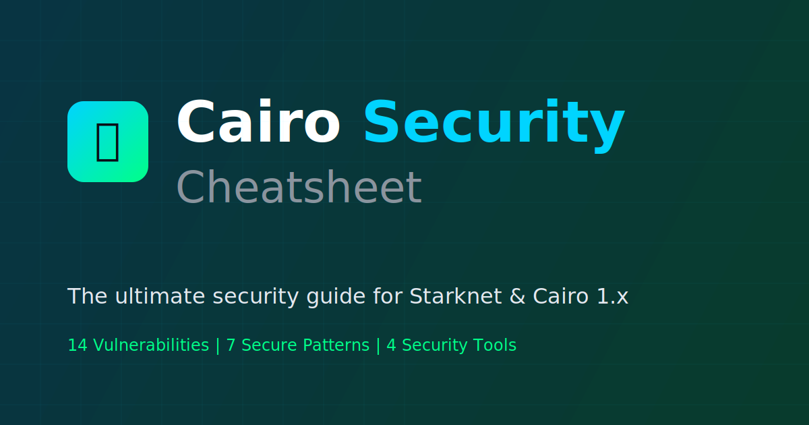

# 🔐 Cairo Security Cheatsheet
[](https://mariano-aguero.github.io/cairo-security-cheatsheet)
[](LICENSE)
[](CONTRIBUTING.md)
[](https://book.cairo-lang.org/)

<p align="center">
  
</p>

A comprehensive, interactive security guide for Cairo 1.x and Starknet smart contract development. Learn about common vulnerabilities, security patterns, and best practices.

## 🌐 Live Demo
**[View the Cheatsheet →](https://mariano-aguero.github.io/cairo-security-cheatsheet)**

## 📚 Contents

### Getting Started
- 📖 **Overview** - Security mindset in Starknet, ZK-proofs, and Sierra.

### Vulnerabilities
- 💥 **Underflow & Overflow** - Arithmetic out-of-bounds in felts and integer types.
- 🔑 **Inadequate Access Control** - Unprotected administrative functions.
- 🔄 **Reentrancy** - External calls allowing malicious recursion.
- 📧 **Insecure L1-L2 Messaging** - Blind trust in Ethereum-originating messages.
- 🚀 **Unprotected Initializers** - Risk in proxy and upgradeable patterns.
- 👤 **Constructor Caller Address** - Issues with `get_caller_address()` in constructors.
- ➗ **Integer Division & Precision** - Rounding down in arithmetic operations.
- 📢 **Missing Event Emission** - Lack of off-chain visibility for critical actions.
- 🔁 **External Calls in Loops** - Denial of Service (DoS) risks.
- ⚖️ **Felt252 Comparisons** - Unexpected results with signed logic.
- 👤 **Insecure Account Validation** - Risks in custom Account Abstraction.
- 📦 **Component Storage Collision** - Overlapping storage in complex contracts.
- 🏗️ **Unchecked Class Hash Upgrades** - Malicious or incompatible class hash replacement.
- 🧂 **Predictable Salt & Frontrunning** - Contract deployment manipulation.

### Security Patterns
- **Checks-Effects-Interactions (CEI):** Prevent reentrancy by validating conditions, updating state, and then interacting.
- **Standard Access Control:** Use audited components like OpenZeppelin's Ownable or AccessControl.
- **OpenZeppelin Components:** Reuse battle-tested code for tokens, access, and security.
- **Strict Assertions:** Enforce invariants with descriptive error messages.
- **Event-Driven State:** Ensure transparency and off-chain sync via comprehensive event emission.
- **Resource & Step Optimization:** Optimize Cairo code to stay within Starknet resource limits.
- **Pull-over-Push Payments:** Shift gas costs and failure risks to users during fund distribution.

### Security Audit Checklist
- 🏗️ **Architecture:** CEI pattern, protected initializers, whitelisted upgrades, and storage namespacing.
- 🔢 **Arithmetic:** Avoiding `felt252` for logic, handling division precision, and safe integer types.
- 🔑 **Access Control:** `get_caller_address()` in constructors, restricted admin functions, L1 handlers, and AA validation.

### Tools & Resources
- **Scarb:** Build toolchain and package manager for Cairo.
- **Starknet Foundry:** Rapid testing and development toolkit.
- **Caracal:** Static analysis for Starknet smart contracts.
- **Starknet-compile:** Official compiler for Sierra and CASM.

## 🚀 Quick Start

### View Online
Simply visit the [GitHub Pages site](https://mariano-aguero.github.io/cairo-security-cheatsheet).

### Run Locally
```bash
# Clone the repository
git clone https://github.com/mariano-aguero/cairo-security-cheatsheet.git

# Open in browser
cd cairo-security-cheatsheet
open index.html

# or use a local server
python3 -m http.server 8000
```

## 📖 Additional Resources

### Documentation
- [Cairo Book](https://book.cairo-lang.org/)
- [Starknet Docs](https://docs.starknet.io/)
- [Starknet Foundry Docs](https://foundry-rs.github.io/starknet-foundry/)

### Security References
- [Cairo Security Guide](https://github.com/starkware-libs/cairo-security-guide)
- [OpenZeppelin Cairo Contracts](https://github.com/OpenZeppelin/cairo-contracts)

## 🤝 Contributing
Contributions are welcome! Please read our [Contributing Guidelines](CONTRIBUTING.md) before submitting a Pull Request.

1. Fork the repository
2. Create your feature branch (`git checkout -b feature/new-vulnerability`)
3. Commit your changes (`git commit -m 'Add new vulnerability section'`)
4. Push to the branch (`git push origin feature/new-vulnerability`)
5. Open a Pull Request

## 📄 License
This project is licensed under the [MIT License](LICENSE).

## ⭐ Support
If you find this cheatsheet useful, please consider giving it a ⭐ star on GitHub!

---
<p align="center">
  Made with 🔐 for the Starknet community
</p>
